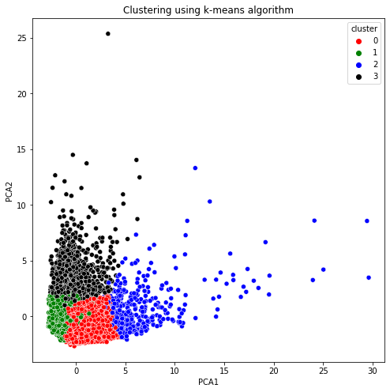

# 
 About Dataset
## 
WHAT IS MARKET SEGMENTATION?
- In marketing, market segmentation is the process of dividing a broad consumer or business market, normally consisting of existing and potential customers, into subgroups of consumers based on some type of shared characteristics.

### 
Objective :
This case requires developing a customer segmentation to give recommendations like saving plans, loans, wealth management, etc. on target customer groups.

## 
Dataset

The sample Dataset summarizes the usage behavior of about 9000 active credit cardholders during the last 6 months. The file is at a customer level with 18 behavioral variables.
- Variables of Dataset
- Balance
- Balance Frequency
- Purchases
- One-off Purchases
- Installment Purchases
- Cash Advance
- Purchases Frequency
- One-off Purchases Frequency
- Purchases Installments Frequency
- Cash Advance Frequency
- Cash Advance TRX
- Purchases TRX
- Credit Limit
- Payments
- Minimum Payments
- PRC Full payment
- Tenure
- Cluster

> The sample Dataset summarizes the usage behavior of about 9000 active credit cardholders during the last 6 months. The file is at a customer level with 18 behavioral variables.

# 
 Analysis
**The project is found in customer_segmentation.ipynb**
- ## STEPS  
- Import the data
- Do some data preparation, cleaning and scaling the data for easy modeling
- Hyperparameter tuning to select the best vakue of k which is the number of clusters
- Segmentation Model buildibg and visualization. the result is visualized as follows
  - 
- Adding predicted segments as target to the original dataset
- Building and testing a new supervised model to predict customer segments. The final model was 94% accurate in its prediction.